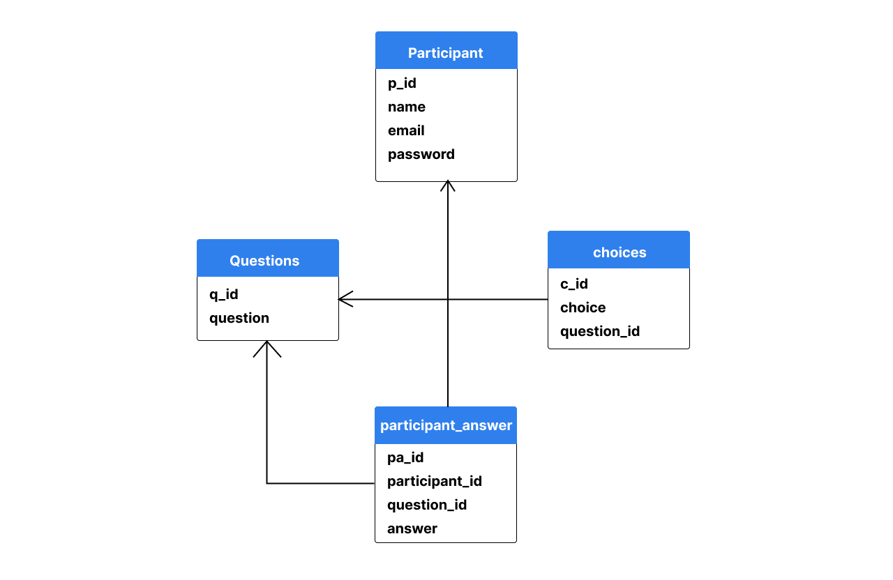

# Node JS multiple choice

This is a database design system for backend to implement relation database as well as to learn JWT authentication with express validator

## participant
Table participant is to store registered user

## questions
Table question is to store questions

## choices
Table choices is to store choices that is related to table questions by question_id

## participant_answer
Table participant_answer is to store user's answer
